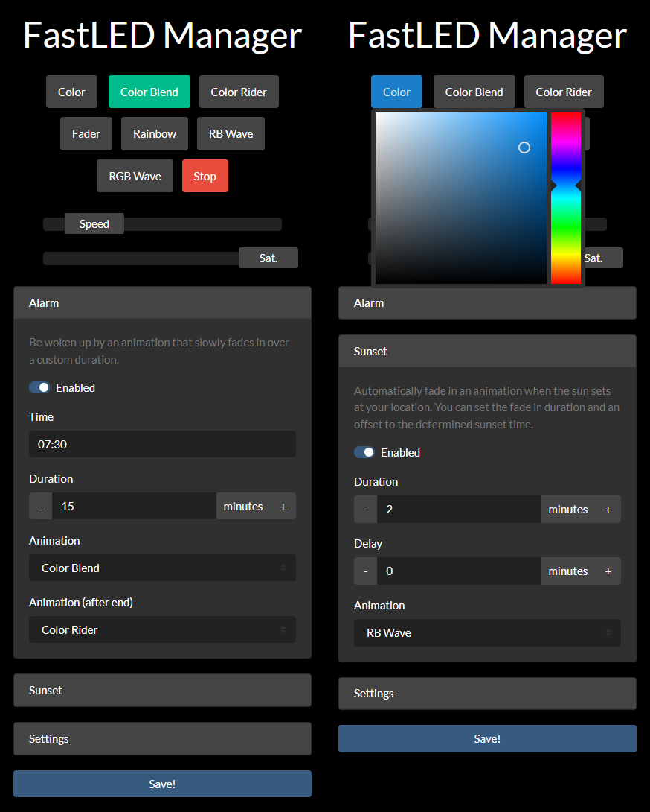

# FastLEDHub

[](https://www.ardu-badge.com/FastLEDHub)
[](https://github.com/stnkl/EverythingToolbar/blob/master/LICENSE)

FastLEDHub allows you to manage all of your [FastLED]([FastLED](https://github.com/FastLED/FastLED)) sketches on the ESP8266 with minimal changes to your existing code. FastLEDHub is compatible with most of the demo sketches at [atuline/FastLED-Demos](https://github.com/atuline/FastLED-Demos). It requires little knowledge about the ESP8266 platform making in an ideal playground for beginners getting started with FastLED animations.

## Features

- Control multiple animations via an intuitive web interface
- Use hardware inputs to cycle through animations and adjust the brightness
- Adjust the animation speed globally
- Select any constant color via the web interface
- Define custom numeric sliders to parameterize your animations
- Alarm: Be woken up to an animation slowly fading in
- Sunset: Automatically fade in an animation when the sun sets at your location
- Control animations using HTTP requests for easy automation

## Web interface



## Installation

### Library dependencies

- ArduinoJson
- LinkedList
- WebSockets
- FastLED
- ESPEssentials
- WiFiManager (≥ 2.0.0)

<!--
### Official releases via the Arduino IDE v1.8+
1. Open the Arduino IDE
2. Navigate to _"Sketch"_ &#8594; _"Include Library"_ &#8594; _"Manage Libraries..."_
3. Search for `FastLEDHub` and install the desired version
-->

### Manual Installation

1. Make sure you have installed the dependencies above
2. Download the desired version from the [releases](https://github.com/stnkl/FastLEDHub/releases) page
3. Extract the contents of the downloaded zip file
4. Rename the extracted folder to `FastLEDHub`
5. Move this folder to your libraries directory `~/Arduino/libraries`)
6. Restart your Arduino IDE

### Using Git

```bash
cd ~/Arduino/libraries
git clone https://github.com/stnkl/FastLEDHub.git
```

To update to the latest version of the library

```bash
cd ~/Arduino/libraries/FastLEDHub && git pull
```

## Usage

Using FastLEDHub to manage your FastLED animations requires mainly three steps:

- Creating the main sketch to initialize your lightstrip with FastLEDHub
- Creating an animation or modifying an existing sketch to be compatible with FastLEDHub
- Registering your animations in the main sketch

### Creating the main sketch

```cpp
#include <FastLEDHub.h>
#include <ESPEssentials.h>

#define NUM_LEDS 6
#define LED_TYPE WS2812B
#define LIGHTSTRIP_PIN 5

void setup()
{
  FastLEDHub.initialize("Project Name", NUM_LEDS);
  FastLEDHub.addLeds<LED_TYPE, LIGHTSTRIP_PIN, GRB>(FastLEDHub.hardwareLeds, NUM_LEDS);
}

void loop()
{
  FastLEDHub.handle();
}
```

Change `NUM_LEDS`, `LED_TYPE` and `LIGHTSTRIP_PIN` according to your hardware configuration. You may notice that this is not different than setting up a regular FastLED sketch apart from using `FastLEDHub` instead of `FastLED`.

### Adding a new animation

Create a new animation file `Animations/ExampleAnimation.h`:

```cpp
#pragma once

#include <FastLEDHub.h>

class ExampleAnimation : public Animation
{
public:
    using Animation::Animation;

    // add variables and other functions if needed

    void reset()
    {
      // set initial state variables
    }

    void loop()
    {
      // animate FastLEDHub.leds
    }
};
```

While creating your animation proceed as you usually would with FastLED by defining the `reset` and `loop` functions. `reset` will be called each time an animation gets started. Use this function to reset the state variables of your animation to its starting values. It will not be called when resuming the animation from the paused status. `loop` will be called repeatedly as long as the animation is running.

Keep in mind the following important differences to just using FastLED:
- The regular `setup` function is called `reset` to emphasize its purpose
- Instead of creating your own `leds` array use the existing `FastLEDHub.leds`
- Within your animation use `FastLEDHub.numLeds` instead of `NUM_LEDS`
- Every time you may want to use `FastLED` use `FastLEDHub` instead. Since `FastLEDHub` inherits from `FastLED` all member functions will be available just like before. FastLEDHub just adds some stuff on top of that.

If you want to convert an existing FastLED sketch (e.g. from [atuline/FastLED-Demos](https://github.com/atuline/FastLED-Demos)), so it can be handled by FastLEDHub, those are the necessary changes you have to perform.

### Registering animations

In your main sketch include your animations and register them at the end of the `setup` function:

```cpp
#include "Animations/ExampleAnimation.h"

...

registerAnimation(new ExampleAnimation("Example animation name"));
```

The animation name can be any unique string and will be used to identify animations in the web interface.

## Additional features

### Static color display

FastLEDHub allows you to display a static color in the web interface. It will be handled as a separate animation and will always have animation index `0`. This is important if you want to trigger animations using HTTP requests.

### Pre-defined and custom sliders

You can add custom numeric sliders of type `int16_t` to adjust variables of animations dynamically. FastLEDHub automatically adds two sliders for brightness (0-1023, default: 1023) and animation speed (0-255, default: 127). Both of these fixed sliders have been integrated tightly into FastLEDHub and don't require any further attention. Changing the brightness will apply gamma correction automatically. Adjusting the speed will affect the effective delay of `FastLEDHub.delay()` to speed up or slow down animations. To prevent this explicitly use `FastLED.delay()` or Arduino's standard `delay()`.

To add more custom sliders simply register them in the main sketch via

```cpp
FastLEDHub.registerSlider(new Slider("Saturation", 150, 255, 200, 1));
```

This example registers a slider with a range of `150-255` and step size `1` defaulting to the value `200`. Again the slider name `"Saturation"` can be any unique string identifying the slider in the web interface.

To access custom slider values inside of your animation use

```cpp
int16_t saturation = FastLEDHub.getSlider("Saturation")->value;
```

### Hardware inputs

FastLEDHub supports a potentiometer for brightness adjustments and a push button to cycle through animations. They have to be specifically enabled with

```cpp
FastLEDHub.enablePotentiometer(potentiometerPin);
```

and

```cpp
FastLEDHub.enableToggleButton(togglePin);
```

### Alarm and sunset

Setting up an alarm in the web interface will fade in a user defined animation over any period of time to wake you up in the morning. You can optionally set a different animation to be started after the fade in period has ended (i.e. full brightness has been reached).

Similarly the sunset feature will fade in an animation as soon as the sun sets at your location. Please configure latitude, longitude and time zone in the web interface beforehand.

### Control via HTTP requests

Most functions can be triggered via HTTP requests:

- Begin animation by name: `http://<device-ip>/begin?animation=<animation-name>`
- Begin animation by index: `http://<device-ip>/begin?index=<animation-index>`
- Stop animation: `http://<device-ip>/stop`
- Pause animation: `http://<device-ip>/pause`
- Resume animation: `http://<device-ip>/resume`
- Toggle animation: `http://<device-ip>/toggle`
- Restart animation: `http://<device-ip>/restart`
- Trigger sunset: `http://<device-ip>/sunset`
- Trigger alarm: `http://<device-ip>/alarm`
- Reset ESP8266: `http://<device-ip>/reboot`
